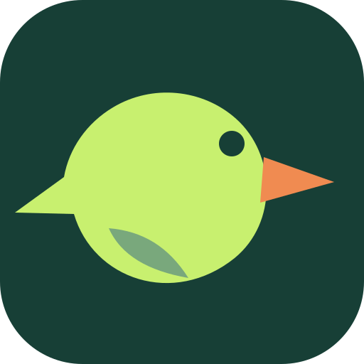
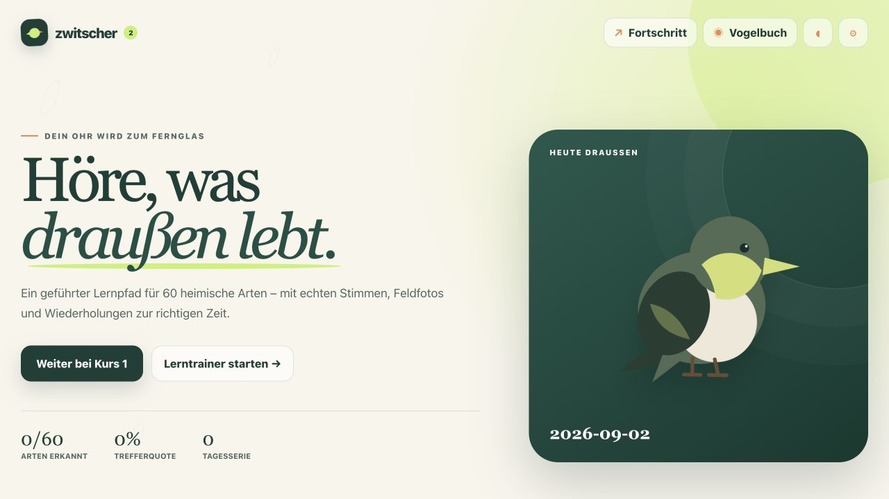
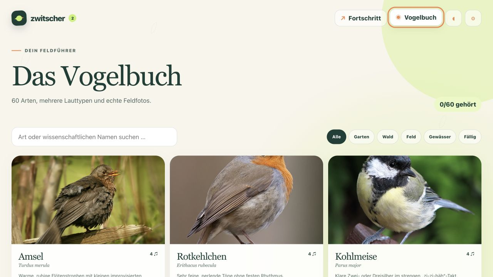
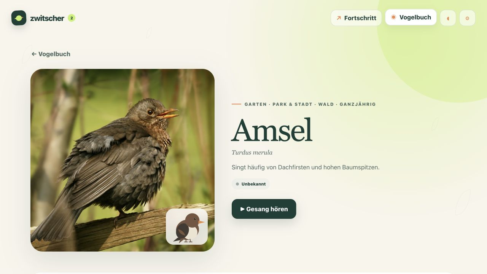

<div align="center">



# Zwitscher 2

**Vogelstimmen hören, unterscheiden und dauerhaft lernen.**

Eine geführte, vollständig offline nutzbare Lern-App für 60 heimische Vogelarten.<br>
Alle persönlichen Daten bleiben lokal auf dem Gerät.

[**App öffnen**](https://derpaile.github.io/zwitscher/) · [Funktionen](#funktionen) · [Entwicklung](#entwicklung)


[](https://github.com/derpaile/zwitscher/actions/workflows/deploy-pages.yml)

</div>



## Funktionen

- **Geführter Lernpfad:** acht Kurse mit Kennenlernen, A/B-Unterscheidung, Vierer-Auswahl, freier Bestimmung und Prüfung
- **Echte Medien:** 60 Arten mit je vier lokalen Stimmen und 60 Feldfotos
- **Nachhaltiges Lernen:** getrennte Wiederholungen nach Art und Lauttyp mit Intervallen bis 120 Tage
- **Abwechslungsreiches Training:** Einstufungstest, sechs freie Modi, Tagesaufgabe und Lebensraum-Expeditionen
- **Feldführer:** Vogelbuch, Artenporträts, A/B-Vergleich, Tempo, Ausschnittschleife und Frequenzbild
- **Privat und offline:** lokaler Lernstand, lokale Sicherungsdateien und pausierbare Komplettinstallation aller Medien
- **Barrierearm:** hoher Kontrast, große Schrift, reduzierte Bewegung und Tastaturbedienung
- **Für Web und Desktop:** installierbare PWA sowie native macOS-App mit Tauri

<table>
  <tr>
    <td width="50%">
      
      <br><sub><b>Vogelbuch:</b> 60 Arten durchsuchen und nach Lebensraum filtern.</sub>
    </td>
    <td width="50%">
      
      <br><sub><b>Artenporträt:</b> Stimmen, Merksätze und Verwechslungspartner direkt vergleichen.</sub>
    </td>
  </tr>
</table>

## Entwicklung

```bash
npm install
npm run dev
```

Die Entwicklungsfassung läuft anschließend unter `http://localhost:5173`.

### Tests und Produktionsprüfung

```bash
npm test
npm run test:e2e
npm run build
```

`npm run build` prüft zugleich Artenzahl, Medien, Lizenzfelder und die harte Paketgrenze von 150 MB.

## Medien und Lizenzen

Die Aufnahmen werden beim Import normalisiert, mit einem einpoligen Hochpass bei 180 Hz gegen Wind-Rumpeln gefiltert und mit 20/30 ms Fade-in/out gegen Klicks versehen. Einen ungefilterten Altbestand bearbeitet einmalig:

```bash
npm run filter:audio
```

Primärquelle ist [Wikimedia Commons](https://commons.wikimedia.org/wiki/Category:Audio_files_of_birds). Als artgetaggte Ergänzungen durchsucht die Importlogik [Openverse](https://openverse.org/) und [GBIF](https://www.gbif.org/). Zugelassen werden ausschließlich CC0, Public Domain, CC BY und CC BY-SA; NC-, ND- und unklare Lizenzen werden verworfen.

```bash
npm run audit:licenses
npm run audit:licenses:online
npm run discover:audio -- amsel
npm run add:audio:wikimedia -- --dry-run
```

Rechercheergebnisse und ausgeschlossene Archive stehen in [AUDIO_SOURCES.md](AUDIO_SOURCES.md). Vollständige Quellen- und Lizenzangaben befinden sich in [`public/media/manifest.json`](public/media/manifest.json) und in der App.

## Veröffentlichung auf GitHub Pages

Der Workflow [`.github/workflows/deploy-pages.yml`](.github/workflows/deploy-pages.yml) baut und veröffentlicht jeden Push auf `main`. In den Repository-Einstellungen muss unter **Pages** die Quelle **GitHub Actions** gewählt sein.

Der Pages-Build setzt `VITE_BASE_PATH=/zwitscher/`, damit Audio, Fotos und Offline-Service-Worker auch unter der Projektadresse funktionieren.

## macOS-App

```bash
npm run mac:dev
npm run mac:build
```

Der Build erzeugt `Zwitscher.app` und einen DMG-Installer unter `src-tauri/target/release/bundle/`. Die lokale Fassung wird ad-hoc signiert. Für eine öffentliche Weitergabe ohne Gatekeeper-Warnung sind ein Apple-Entwicklerkonto und eine Notarisierung erforderlich.
